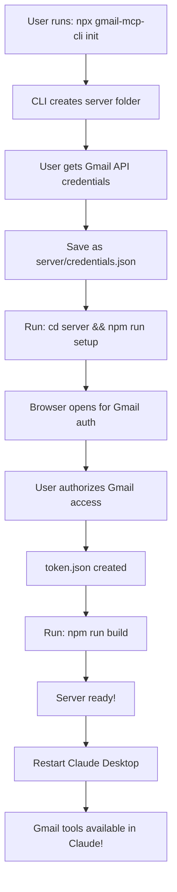

# 🎯 Complete User Flow - Gmail MCP Server

## 📊 Setup Flow (One-Time)



## 💬 Usage Flow (Daily Use)

```mermaid
graph LR
    A[User asks Claude:<br/>"Show my emails"] --> B[Claude Desktop]
    B --> C[MCP Protocol]
    C --> D[Gmail MCP Server]
    D --> E[Gmail API]
    E --> F[User's Gmail]
    F --> G[Email Data]
    G --> D
    D --> C
    C --> B
    B --> H[Claude shows emails<br/>with AI insights]
```

## 🛠️ What Each Component Does

### **1. Gmail MCP CLI** (`npx gmail-mcp-cli`)
- Creates project structure
- Configures Claude Desktop
- Provides easy setup wizard

### **2. Gmail MCP Server** (runs in background)
- Connects to Gmail API
- Provides 17 tools to Claude
- Handles authentication
- Processes email operations

### **3. Claude Desktop** (user interface)
- Sends user requests to server
- Displays results with AI analysis
- Manages tool permissions

## 🎮 Example User Interactions

### **Basic Email Operations**
```
User: "Show me emails from this week"
Claude: [Uses get_emails tool] Here are your emails from this week...

User: "Any urgent emails?"
Claude: [Uses analyze_emails tool] I found 3 urgent emails requiring attention...
```

### **Subscription Management**
```
User: "List my subscriptions"
Claude: [Uses manage_subscriptions tool] You have 15 email subscriptions...

User: "Unsubscribe me from promotional emails"
Claude: [Uses manage_subscriptions with unsubscribe action] Found unsubscribe links...
```

### **Email Composition**
```
User: "Reply to John's email about the meeting"
Claude: [Uses reply_email tool] I've drafted a reply...

User: "Send it"
Claude: [Updates with send:true] Email sent successfully!
```

## 🔒 Security & Privacy

1. **Local Processing**: All email data stays on your machine
2. **OAuth2 Security**: Uses Google's secure authentication
3. **Token Storage**: Credentials stored locally, never shared
4. **User Control**: You approve each Claude action

## 🚀 Quick Commands Reference

| Command | What it does |
|---------|--------------|
| `npx gmail-mcp-cli init` | Initial setup |
| `cd server && npm run setup` | Gmail authorization |
| `npm run build` | Build server |
| `npx gmail-mcp-cli status` | Check status |
| `npx gmail-mcp-cli deploy` | Deploy server |

## 📱 Common Use Cases

1. **Email Management**
   - "Show unread emails"
   - "Search for invoices"
   - "Star important emails"

2. **Productivity**
   - "What needs my response?"
   - "Summarize long email threads"
   - "Extract action items"

3. **Organization**
   - "Create a label for project X"
   - "Archive old emails"
   - "Clean up my inbox"

4. **Communication**
   - "Draft a follow-up email"
   - "Reply to all team members"
   - "Schedule email for later"

## 🆘 Troubleshooting

### Claude doesn't show Gmail tools
1. Check `claude_desktop_config.json`
2. Ensure server path is correct
3. Restart Claude Desktop

### "Not authorized" errors
1. Delete `token.json`
2. Run `npm run setup` again
3. Re-authorize Gmail access

### Server won't start
1. Check Node.js version (18+)
2. Run `npm install` in server folder
3. Rebuild with `npm run build`
